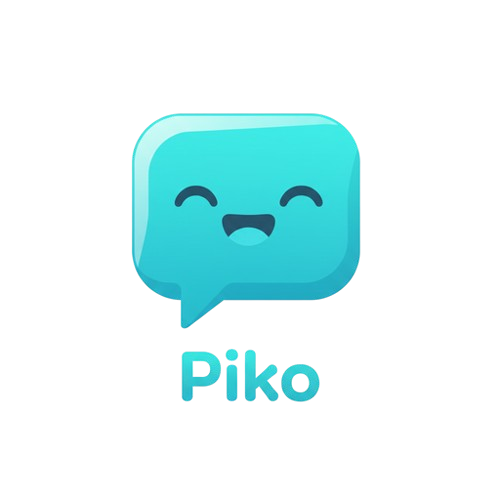
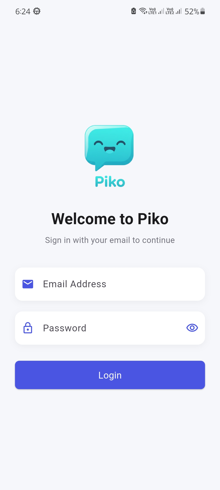
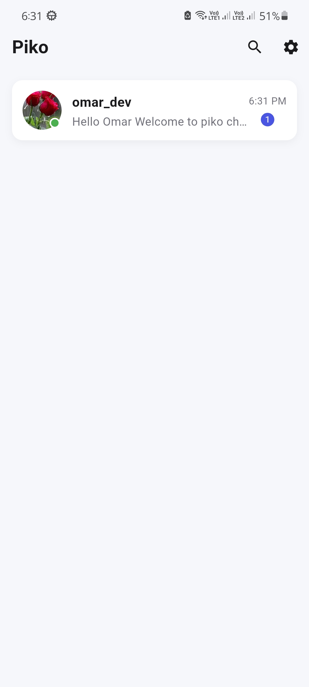
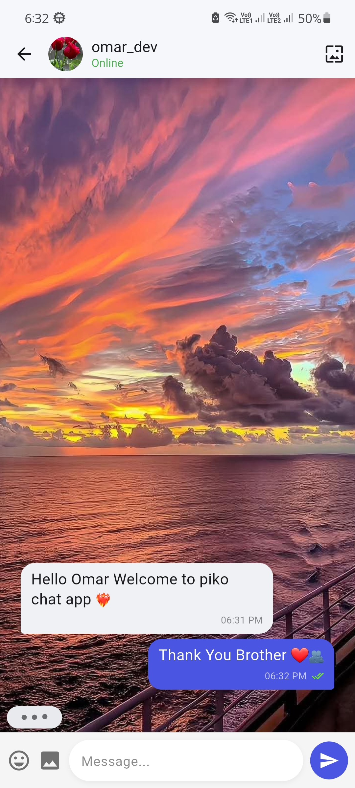

# Piko — Modern Chat App

[](#)
[](#)
[](#)

---

<p align="center">
  
</p>

**Piko** is a modern, privacy-minded, real-time chat application built with Flutter. It emphasizes a
clean UX, real-time messaging powered by Firebase, and a modular architecture that makes it easy to
extend and maintain.

> This README is structured to help contributors, reviewers, and new developers quickly understand
> and run the project.

---

## 🔑 Highlights

- ✅ Real-time messaging with Cloud Firestore
- ✅ Secure authentication with Firebase Auth
- ✅ Optimized image handling and caching
- ✅ Dark + Light themes with accessible color system
- ✅ Clean, feature-based architecture
- ✅ Push notifications (OneSignal + local)
- ✅ CI-ready and production-oriented project structure

---

## 📸 Screenshots / Preview

> Replace these placeholders with real screenshots from `screenshots/` or `assets/`.

|                 Login                  |                 Home                 |                 Chat                 |
|:--------------------------------------:|:------------------------------------:|:------------------------------------:|
|  |  |  |

---

## 🏗️ Architecture Overview

```
lib/
├─ core/            # Shared services, themes, models, DI
│  ├─ di/           # Dependency injection (GetIt)
│  ├─ theme/        # Colors, typography, widgets
│  ├─ models/       # DTOs & domain models
│  └─ utils/        # helpers, constants
├─ features/
│  ├─ auth/         # login, register
│  ├─ home/         # chats list, search
│  ├─ chat/         # conversation UI & message handling
│  ├─ settings/     # user settings & theme
│  └─ onboarding/
└─ main.dart
```

This layout helps keep features self-contained and easier to test.

---

## 🧩 Tech Stack

- Flutter
- Firebase (Auth, Firestore,)
- Cloudinary (image hosting)
- Bloc (flutter_bloc)
- GetIt (dependency injection)
- cached_network_image, image_picker
- OneSignal (notifications)
- Shared Preferences (local storage)
- Optional: CI (GitHub Actions) for build & test

---

## 🎯 Design & UX Decisions

- **Colors & Theming** — centralized in `ColorsManager` (supports Light & Dark).
- **Chat Bubbles** — designed for legibility and accessibility. Sender bubble uses primary brand
  color; receiver uses soft neutral tones.
- **Performance** — image caching, limited list item rebuilds, stream-based updates to minimize UI
  thrash.

---

## 🚀 Getting Started (Developer)

### Prerequisites

- Flutter SDK (stable)
- Android Studio or VS Code
- A Firebase project and the `google-services.json` (Android) / `GoogleService-Info.plist` (iOS)

### Quick setup

```bash
# Clone
git clone https://github.com/<your-username>/piko.git
cd piko

# Install
flutter pub get

# Run
flutter run
```

### Firebase setup

1. Create a Firebase project.
2. Enable **Authentication** (Email/Password).
3. Create a **Cloud Firestore** database in test or production mode.
4. Add Android app: download `google-services.json` → put in `android/app/`.
5. (iOS) Add iOS app: download `GoogleService-Info.plist` → put in `ios/Runner/`.
6. (Optional) Configure Firebase rules for production.

---

## 🧪 Testing

- Unit tests: `flutter test`
- Widget/integration tests: `flutter drive` / `integration_test`

Consider adding mocks for Firestore and Auth when writing unit tests.

---

## 📌 Pinned Chats & UX Notes

- Pinned chats should be stored as a boolean/priority in Firestore (`pinned: true` or
  `pinnedAt: timestamp`).
- Sort chats locally by `pinned` then `lastMessage.timestamp` to always surface pinned chats at top.

---

## 🛠️ Common commands

```bash
# Analyze
flutter analyze

# Format
flutter format .

# Run on device
flutter run

# Build
flutter build apk --release
```

---

## 📣 Contributing

1. Fork the repo
2. Create a feature branch
3. Open a PR with description & screenshots

Please follow the existing style and write tests for new logic.

---

## 📬 Contact

Omar Shawkey — @OmarShawkey13


---

*Generated and polished for clarity, structure and developer onboarding.*