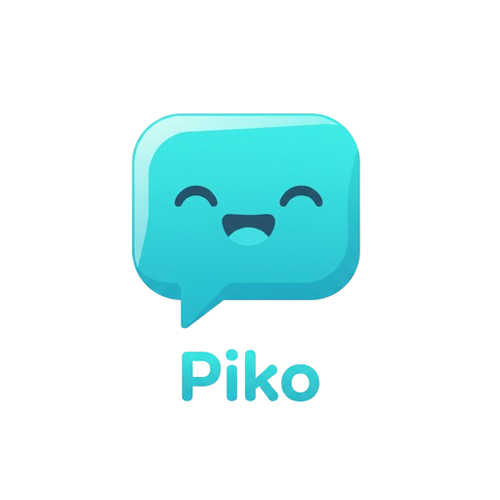
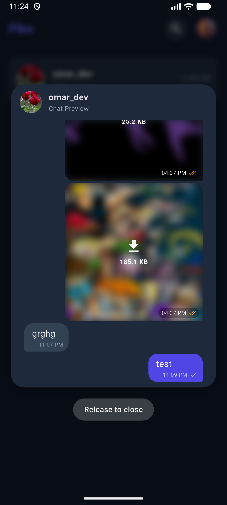
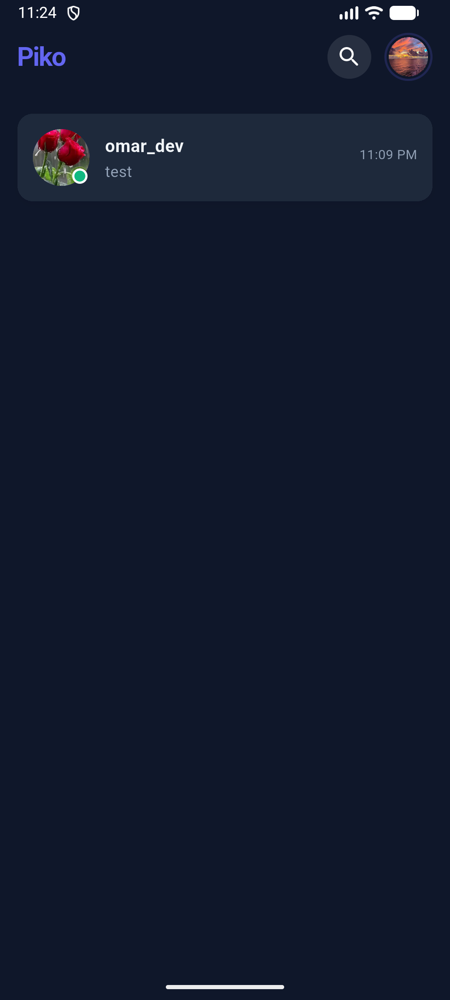

<p align="center">
  
</p>

# Piko — The Ultimate Real-Time Chat Experience 🚀

[](https://flutter.dev)
[](https://firebase.google.com)
[](https://pub.dev/packages/flutter_bloc)
[](#)

**Piko** هو تطبيق دردشة متكامل تم تطويره باستخدام **Flutter** و **Firebase**، يهدف إلى توفير تجربة تواصل فورية، آمنة، وغنية بالمميزات. يعتمد التطبيق على معايير هندسية برمجية عالية لضمان الأداء السلس والقابلية للتوسع.

---

## 📸 معاينة التطبيق (Screenshots)

<p align="center">
  
  
  
</p>

---

## 🌟 القائمة الكاملة للمميزات (Full Feature Set)

### 💬 نظام الدردشة المتقدم (Core Messaging)
- **Real-time Messaging:** مزامنة فورية للرسائل باستخدام `Cloud Firestore`.
- **Media Messaging:** إرسال واستقبال الصور مع معالجة التحميل (Loading States) والتحميل الفاشل.
- **Reply System:** دعم الرد على رسائل محددة مع مؤشر بصري (Reply Indicator) ومعاينة للرسالة المردود عليها (Reply Preview).
- **Typing Indicators:** عرض مؤشر "يكتب الآن..." (Typing Bubble) بشكل حيوي عند كتابة الطرف الآخر.
- **Message Status:** تتبع حالة الرسالة (ارسال، وصول، قراءة) بدقة.
- **Online/Offline Status:** عرض حالة المستخدم (متصل الآن) في الوقت الفعلي.
- **Emoji Picker:** منتقي رموز تعبيرية (Emoji) مدمج ومخصص يدعم التصنيفات المختلفة لسهولة التعبير.
- **iOS Style Context Menu:** قائمة خيارات متقدمة عند الضغط المطول على الرسائل بتصميم iOS الجذاب، تدعم القوائم الفرعية (Sub-menus) والعمليات التدميرية.
- **Chat Background Customization:** إمكانية تخصيص خلفية المحادثة لكل مستخدم مع حفظها محلياً.
- **Interactive Image Preview:** صفحة مخصصة لمعاينة الصور تدعم التكبير والتصغير (Zoom) باستخدام `InteractiveViewer`.
- **Chat Peek & Preview:** إمكانية إلقاء نظرة سريعة على المحادثة (Preview) من القائمة الرئيسية دون الدخول إليها، مع تأثيرات ضبابية (Blur) جذابة.

### 🔍 البحث والتواصل (Search & Discovery)
- **User Search:** نظام بحث متطور يسمح بالعثور على المستخدمين الآخرين باستخدام اسم المستخدم أو البريد الإلكتروني لبدء محادثات جديدة فوراً.

### 🔔 الإشعارات والتنبيهات (Notifications)
- **Push Notifications:** دمج كامل مع `OneSignal` لاستقبال الإشعارات حتى عند إغلاق التطبيق.
- **Local Notifications:** استخدام `flutter_local_notifications` للتنبيهات الداخلية وإدارة تدفق الإشعارات أثناء فتح التطبيق.
- **Smart Handler:** نظام `NotificationHandler` مخصص لإدارة توجيه المستخدم عند النقر على الإشعار.

### 🔐 التوثيق والملف الشخصي (Auth & Profile)
- **Firebase Auth:** تسجيل دخول وتسجيل حساب جديد آمن.
- **Profile Management:** نظام متكامل لإدارة الملف الشخصي يشمل تعديل الاسم، اسم المستخدم الفريد (@username)، والنبذة الشخصية (Bio).
- **Image Cropping/Picking:** دعم اختيار الصور من المعرض أو الكاميرا وتعيينها كصورة شخصية مع معالجة الرفع في الخلفية.

### 🌍 التخصيص وتجربة المستخدم (UI/UX)
- **Localization:** دعم ثنائي اللغة (عربي/إنجليزي) مع تغيير اتجاه التطبيق بالكامل (RTL/LTR) وحفظ الإعدادات محلياً.
- **Theme Engine:** نظام ثيمات ذكي يدعم `Dark Mode` و `Light Mode` مع حفظ اختيار المستخدم.
- **Onboarding Experience:** شاشات تعريفية جذابة تشرح مميزات التطبيق للمستخدمين الجدد.
- **Modern UI Components:** استخدام مكثف للتأثيرات البصرية مثل `BackdropFilter` للضبابية، والرسوم المتحركة السلسة في الانتقالات بين الشاشات.

---

## 🏗️ الهيكل الهندسي للمشروع (Detailed Architecture)

يتبع المشروع معمارية **Clean Architecture** مقسمة حسب الميزات (**Feature-driven**):

### 📁 `lib/core/` (النواة والأساسيات)
- **`di/`**: إعدادات حقن التبعيات باستخدام `GetIt`.
- **`network/`**: 
    - `local/`: التعامل مع `SharedPreferences` عبر `CacheHelper`.
    - `service/`: إدارة `Firebase Services` و `Notification Service`.
- **`theme/`**: تعريف `AppTheme` للألوان، الخطوط، وأنماط الـ Widgets.
- **`models/`**: نماذج البيانات الموحدة مثل `MessageModel`, `UserModel`.
- **`utils/`**: الثوابت، الملحقات (Extensions)، والـ Cubits العامة (Theme, Auth, Home, Chat).

### 📁 `lib/features/` (الوحدات الوظيفية)
كل ميزة تحتوي على تقسيم داخلي (Data, Presentation, Widgets):
- **`chat/`**: تحتوي على أعقد الـ Widgets مثل `MessageBubble`, `TypingIndicator`, `AttachmentMenu`, `IosStyleContextMenu`.
- **`home/`**: إدارة قائمة المحادثات، البحث عن المستخدمين، ونظام معاينة المحادثة (Chat Preview).
- **`login/` & `complete_profile/`**: دورة حياة المستخدم وتوثيق الحساب.
- **`settings/`**: إدارة الملف الشخصي المتقدمة، اللغة، والثيم.

---

## 🛠️ التقنيات والمكتبات (Tech Stack)

| التقنية                  | الاستخدام                           |
|:-------------------------|:------------------------------------|
| **Flutter Bloc/Cubit**   | إدارة الحالة (State Management)     |
| **Firebase Firestore**   | قاعدة البيانات الفورية              |
| **Firebase Storage**     | تخزين الصور والوسائط                |
| **OneSignal**            | إشعارات الدفع (Push Notifications)  |
| **GetIt**                | حقن التبعيات (Dependency Injection) |
| **Cached Network Image** | معالجة وعرض الصور بذكاء             |
| **Shared Preferences**   | التخزين المحلي للإعدادات            |
| **Image Picker**         | اختيار الوسائط من الجهاز            |

---

## 🚀 تعليمات التشغيل (Setup & Installation)

1. **إعداد Firebase:**
   - قم بإنشاء مشروع جديد في Firebase Console.
   - أضف تطبيقات Android/iOS وحمل ملفات `google-services.json` و `GoogleService-Info.plist`.
   - قم بتفعيل `Authentication` و `Firestore` و `Storage`.

2. **إعداد OneSignal:**
   - قم بإنشاء حساب في OneSignal واحصل على `App ID`.
   - قم بتحديث الـ ID في ملف `lib/main.dart`.

3. **التشغيل:**
```bash
# تحميل المكتبات
flutter pub get

# توليد أي ملفات مفقودة (إن وجدت)
flutter pub run build_runner build

# تشغيل التطبيق
flutter run
```

---

## 📁 الأصول (Assets)
- **Translations**: ملفات JSON للترجمة في `assets/translations/`.
- **Images**: الأيقونات والصور في `assets/images/`.
- **Emojis**: موارد الرموز التعبيرية في `assets/emoji/`.

---

## 👤 المطور
**Omar Shawkey** 
- [GitHub](https://github.com/omarShawkey13)
- [LinkedIn](https://linkedin.com/in/omarshawkey)

---
*هذا التطبيق مبني بأحدث معايير Flutter لعام 2024.*
